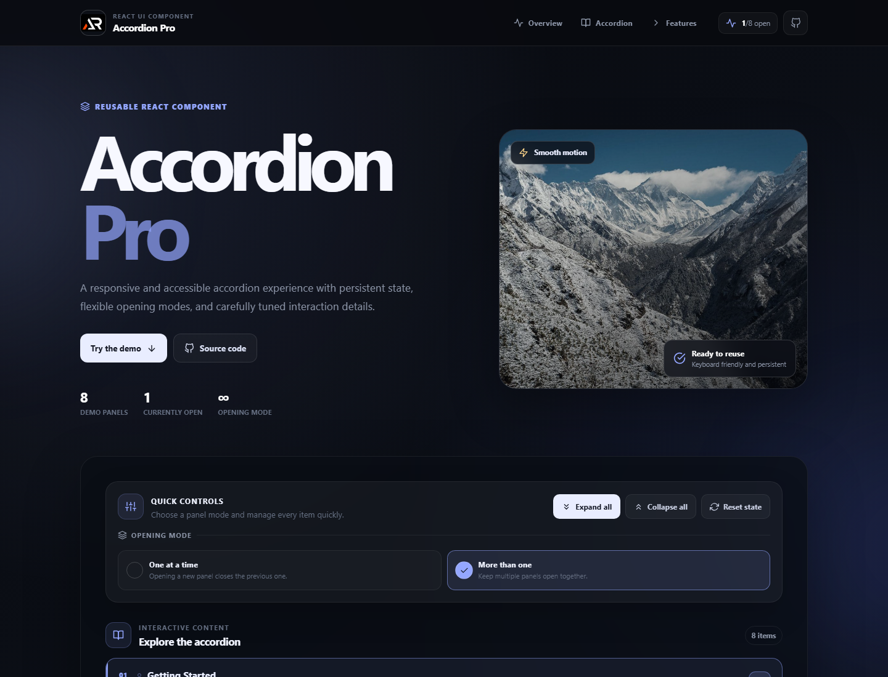

# Accordion Pro

Accordion Pro is a reusable React accordion interface for FAQs, documentation, settings, and knowledge-base pages. It includes persistent open state, single or multiple panel modes, accessible controls, responsive layouts, and lightweight motion.



## Features

- Persistent accordion state with `localStorage`
- Single-panel and multiple-panel opening modes
- Expand all, collapse all, and reset controls
- Keyboard-friendly accordion buttons and visible focus states
- Fixed responsive header, mobile menu, back-to-top control, and icon-only footer links
- Locally stored visual assets and GitHub Pages deployment

## Tech stack

React, Vite, JavaScript, CSS Modules, React Icons

## Run locally

```bash
npm install
npm run dev
```

Check the project with:

```bash
npm run lint
npm run build
```

## Live demo

[https://a2rp.github.io/accordion-pro/](https://a2rp.github.io/accordion-pro/)

## Future prospects

The component can be extended with custom themes, URL-based panel sharing, search within panels, and reusable data-driven presets.

## Images

- `screenshot.png`: Main project preview
- `public/images/accordion-hero.jpg`: Hero image
- `public/images/accordion-controls.jpg`: Controls feature image
- `public/images/accordion-responsive.jpg`: Responsive feature image

## Links

- Portfolio: [https://www.ashishranjan.net/](https://www.ashishranjan.net/)
- GitHub: [https://github.com/a2rp](https://github.com/a2rp)
- CodePen: [https://codepen.io/ash1198](https://codepen.io/ash1198)
- LinkedIn: [https://www.linkedin.com/in/aashishranjan](https://www.linkedin.com/in/aashishranjan)
- Facebook: [https://www.facebook.com/theash.ashish/](https://www.facebook.com/theash.ashish/)
- YouTube: [https://www.youtube.com/@ashishranjan-ashz?sub_confirmation=1](https://www.youtube.com/@ashishranjan-ashz?sub_confirmation=1)
- Email: [mailto:ash.ranjan09@gmail.com](mailto:ash.ranjan09@gmail.com)

## Support

- Support: [https://a2rp-donation-page.netlify.app/](https://a2rp-donation-page.netlify.app/)
- Buy Me a Coffee: [https://buymeacoffee.com/a2rp](https://buymeacoffee.com/a2rp)
- Patreon: [https://www.patreon.com/a2rp](https://www.patreon.com/a2rp)
